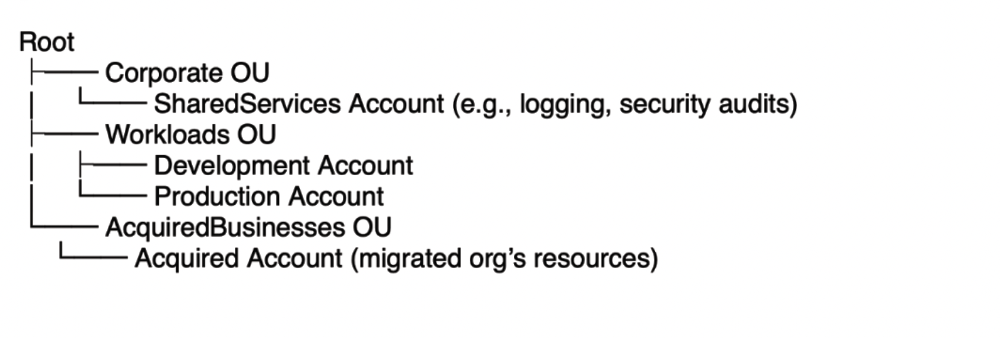
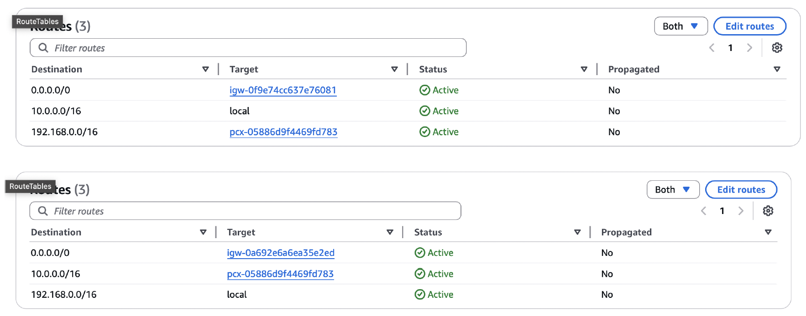
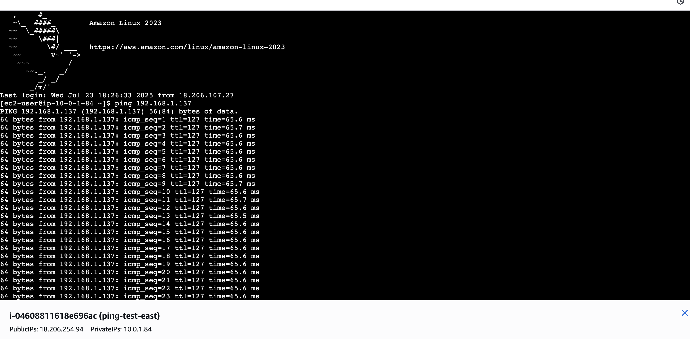

# AWS Multi-Account Organization Architecture

> Designed and implemented a consolidated AWS cloud infrastructure for a pharmaceutical organization, integrating Control Tower, standalone accounts, and an acquired company's AWS environment.

## Overview

| | |
|---|---|
| **Role** | Senior Cloud Architect |
| **Domain** | AWS Organizations, Networking, Governance |
| **Tools** | AWS Control Tower · VPC Peering · SCPs · AWS Config · AWS Budgets |

---

## What Was Built

### Multi-Account OU Hierarchy

Designed a 3-tier AWS Organizations structure to centralize governance across all accounts.

| OU | Purpose |
|---|---|
| **Corporate OU** | Centralized logging, auditing, security |
| **Workloads OU** | Dev/Prod application environments |
| **Acquired Businesses OU** | Staged onboarding for M&A accounts |

---

### Cross-Region VPC Peering

Established private connectivity between two VPCs across AWS regions.

| | VPC 1 | VPC 2 |
|---|---|---|
| **Name** | db-vpc-east | analytics-vpc-west |
| **Region** | us-east-1 | us-west-1 |
| **CIDR** | 10.0.0.0/16 | 192.168.0.0/16 |
| **Private IP** | 10.0.1.84 | 192.168.1.137 |

- Peering Connection ID: `pcx-05886d9f4469fd783` Active
- Connectivity validated via ICMP ping test

---

### Governance & Tagging Strategy

Enforced org-wide compliance using SCPs and AWS Config rules.

| Tag Key | Example Value | Purpose |
|---|---|---|
| Environment | Development / Production | Environment tracking |
| CostCenter | CC-001 | Cost allocation |
| Owner | team@company.com | Accountability |
| Confidentiality | High | Compliance & security |

- 📄 [SCP Policy](policies/scp-required-tags.json) — denies resource creation without required tags
- 📄 [AWS Config Rule](policies/config-rule-required-tags.json) — flags non-compliant resources

---

### Cost Management

Configured AWS Budgets with tiered alerts for EC2 in the Development environment.

| Threshold | Action |
|---|---|
| 80% | Warning email to resource Owner |
| 90% | CostCenter heads notified |
| 100% | Alert triggered to Finance admin |

---

## Skills Demonstrated

`AWS Organizations` `AWS Control Tower` `VPC Peering` `IAM` `SCPs`
`AWS Config` `AWS Budgets` `CloudTrail` `Security Hub` `GuardDuty`
`Multi-Account Strategy` `Cloud Governance` `Cost Optimization`
